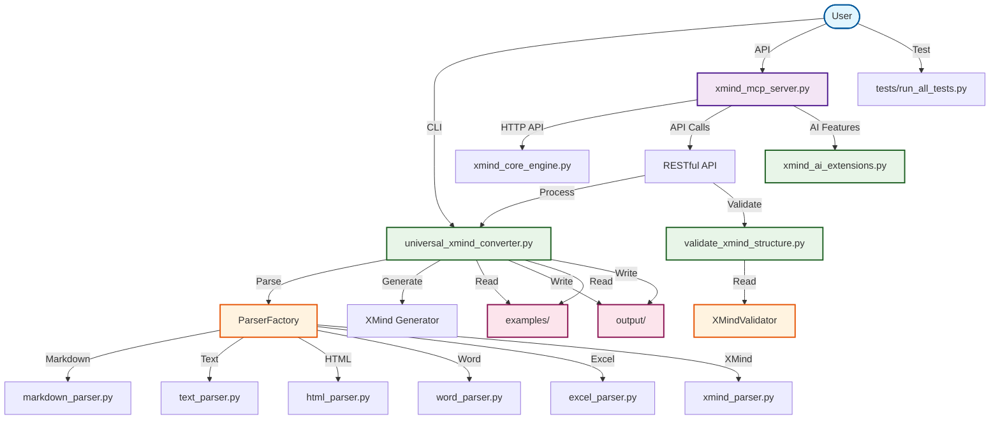

# 🧠 XMind AI MCP Intelligent Mind Mapping Tool

A powerful tool for converting multiple file formats to XMind mind maps with AI-powered analysis and MCP server integration.

## 🚀 Core Features

### 1. Universal File Converter
- **Multi-Format Support**: Convert Markdown, Text, HTML, Word, Excel to XMind
- **Smart Detection**: Auto-identify file types and structure
- **Batch Processing**: Convert multiple files with one command
- **Flexible Output**: Custom output paths and naming patterns

### 2. Standalone Mode
- **Direct Conversion**: Convert files without server setup
- **Command Line Interface**: Simple command format for quick conversion
- **Format Options**: Force specific format or auto-detect
- **Progress Feedback**: Real-time conversion status

### 3. MCP Server Mode
- **RESTful API**: Full HTTP API for all conversion operations
- **IDE Integration**: Seamless integration with Trae and other IDEs
- **Real-time Processing**: Instant conversion via API calls
- **Health Monitoring**: Server status and performance metrics

### 4. AI-Powered Analysis
- **Structure Analysis**: Intelligent mind map structure optimization
- **Content Suggestions**: AI-generated topic recommendations
- **Quality Metrics**: Comprehensive mind map quality assessment
- **Format Validation**: Ensure XMind compatibility and standards

## 📁 Project Structure

```
XmindMcp/
├── configs/                      # MCP configuration files
├── docs/                         # Documentation and guides
├── examples/                     # Sample input files
├── output/                       # Converted XMind files
├── tests/                        # Test suite
├── universal_xmind_converter.py  # Core converter engine
├── xmind_mcp_server.py           # MCP server implementation
├── validate_xmind_structure.py   # XMind validation tools
└── xmind_ai_extensions.py        # AI analysis features
```

## 🔄 Code Call Relationship Diagram



### Call Relationship Description

| Layer | File | Main Function | Dependencies |
|-----|-----|-------------|-------------|
| **User Interface** | `complete_test_suite.py` | Complete test suite | Calls MCP server API |
| | `batch_convert_demo.py` | Batch conversion demo | Direct converter call |
| **Server** | `xmind_mcp_server.py` | MCP server launcher | Creates engine instances |
| **Core Engine** | `xmind_core_engine.py` | XMind core engine | Calls converter and validator |
| | `xmind_ai_extensions.py` | AI extension features | Provides intelligent suggestions |
| **Conversion Tool** | `universal_xmind_converter.py` | Universal format converter | Creates parser factory |
| **Validation Tool** | `validate_xmind_structure.py` | Structure validator | Reads and validates XMind files |

### Data Flow

1. **Input Flow**: `examples/` → `ParserFactory` → `create_xmind_file` → `output/`
2. **Validation Flow**: `output/` → `XMindValidator` → Structure Analysis → Quality Report
3. **AI Flow**: User Input → `AIExtensions` → Intelligent Suggestions → Mind Map Optimization

## 🔧 Quick Start

### 1. Install Dependencies
```bash
pip install beautifulsoup4 python-docx openpyxl fastapi uvicorn
```

### 2. File Conversion (Standalone Mode)

#### Single File Conversion
```bash
# Basic conversion (auto-detect format)
python universal_xmind_converter.py <input_file>

# Specify output path
python universal_xmind_converter.py <input_file> --output <output_path>

# Force specific format
python universal_xmind_converter.py <input_file> --format markdown
```

#### Batch Conversion
```bash
# Convert all files in a directory
python universal_xmind_converter.py <input_directory> --batch

# Convert specific file types
python universal_xmind_converter.py <directory> --batch --format markdown,html,txt
```

#### Examples
```bash
# Convert Markdown file
python universal_xmind_converter.py examples/test_markdown.md

# Convert with custom output
python universal_xmind_converter.py examples/test_document.docx --output my_mind_map.xmind

# Batch convert all text files
python universal_xmind_converter.py examples/ --batch
```

### 3. MCP Server Mode

#### Start Server
```bash
# Start with default port (8080)
python xmind_mcp_server.py

# Custom port
python xmind_mcp_server.py --port 9000

# Debug mode
python xmind_mcp_server.py --debug
```

#### API Endpoints
Once server is running, available endpoints:
- `POST /tools/convert_to_xmind` - Convert files to XMind
- `POST /tools/read_xmind` - Read XMind file content
- `POST /tools/analyze_mind_map` - Analyze mind map structure
- `POST /tools/create_mind_map` - Create new mind map
- `POST /tools/list_xmind_files` - List XMind files
- `GET /health` - Health check

#### Usage Examples
```bash
# Convert via API (using curl)
curl -X POST "http://localhost:8080/tools/convert_to_xmind" \
  -H "Content-Type: application/json" \
  -d '{"source_filepath": "examples/test.md", "output_filepath": "output/result.xmind"}'

# Read XMind file
curl -X POST "http://localhost:8080/tools/read_xmind" \
  -H "Content-Type: application/json" \
  -d '{"filepath": "output/result.xmind"}'
```

### 4. IDE Integration (Trae MCP)

#### Configuration Template
Create MCP configuration in your IDE:

```json
{
  "mcpServers": {
    "xmind-converter": {
      "command": "python",
      "args": ["<absolute_path_to_project>/xmind_mcp_server.py"],
      "description": "XMind AI MCP"
    }
  }
}
```

#### Replace Placeholders
- `<absolute_path_to_project>` - Your project directory absolute path
- Modify port if needed: add `"--port", "8080"` to args

#### Example Configuration
```json
{
  "mcpServers": {
    "xmind-converter": {
      "command": "python",
      "args": ["D:/projects/xmind-converter/xmind_mcp_server.py", "--port", "8080"],
      "description": "XMind AI MCP"
    }
  }
}
```

### 5. Run Tests
```bash
# Run all tests
python tests/run_all_tests.py

# English mode
python tests/run_all_tests.py --english

# Test specific module
python tests/test_setup.py
python tests/test_core.py
```

## 📋 Available Tools

After successful configuration, you can use in Trae:

1. **read_xmind_file** - Read XMind file content
2. **create_mind_map** - Create new mind map
3. **analyze_mind_map** - Analyze mind map structure
4. **convert_to_xmind** - Convert files to XMind format
5. **list_xmind_files** - List XMind files
6. **ai_generate_topics** - AI generate topic suggestions

## 🎯 Usage Examples

### Standalone Mode - File Conversion

#### Single File Conversion
```bash
# Basic conversion (auto-detect format)
python universal_xmind_converter.py <input.md> <output.xmind>

# Force specific format
python universal_xmind_converter.py <input.txt> /path/to/output/ --format text

# Custom output directory
python universal_xmind_converter.py <input.md> <output.xmind> --output-dir
```

#### Batch Conversion
```bash
# Convert all supported files in a directory
python universal_xmind_converter.py --batch examples/ output/

# Convert specific file types
python universal_xmind_converter.py --batch examples/ output/ --include "*.md,*.txt"

# Recursive batch conversion
python universal_xmind_converter.py --batch examples/ output/ --recursive
```

### Convert Markdown to Mind Map
```python
# Call MCP tool in Trae
convert_to_xmind({
    "source_filepath": "examples/playwright-learning-guide.md",
    "output_filepath": "output/my-guide.xmind"
})
```

### AI Generate Mind Map
```python
ai_generate_topics({
    "context": "Frontend Development Learning Path",
    "max_topics": 15
})
```

### Analyze Existing Mind Map
```python
analyze_mind_map({
    "filepath": "output/test_outline.xmind"
})
```

## 📖 Detailed Documentation

- **[Universal Converter Usage Guide](UNIVERSAL_CONVERTER_USAGE.md)** - Multi-format conversion details
- **[Trae MCP Configuration Guide](TRAE_MCP_SETUP.md)** - Detailed MCP configuration methods
- **[Conversion Validation Report](conversion_validation_report.md)** - Conversion quality validation results
- **[XMind AI MCP Design Scheme](xmind_ai_mcp_design.md)** - Technical architecture design

## 🎨 Supported Formats

### Markdown Format
```markdown
# Main Title
## First Level Branch
### Second Level Branch
## Another First Level Branch
```

### Text Outline
```
Main Title
  First Level Branch
```

### HTML Format
```html
<h1>Main Title</h1>
<h2>First Level Branch</h2>
<h3>Second Level Branch</h3>
```

### Supported File Types
- **Markdown** (.md, .markdown)
- **Text** (.txt, .text)
- **HTML** (.html, .htm)
- **Word** (.docx)
- **Excel** (.xlsx)
- **CSV** (.csv)
- **JSON** (.json)
- **XML** (.xml)
- **YAML** (.yaml, .yml)

## 🤝 Contributing

1. Fork the repository
2. Create your feature branch (`git checkout -b feature/amazing-feature`)
3. Commit your changes (`git commit -m 'Add some amazing feature'`)
4. Push to the branch (`git push origin feature/amazing-feature`)
5. Open a Pull Request

## 🔍 Validation & Quality

- ✅ **9 File Formats** conversion validation all passed
- ✅ **Structure Integrity** maintains original hierarchical relationships
- ✅ **Content Fidelity** completely preserves text content
- ✅ **Format Compatibility** complies with XMind standards

## 🛠️ Technical Features

- **Modular Design**: Easy to extend and maintain
- **Error Handling**: Comprehensive exception handling mechanism
- **Performance Optimization**: Supports large file streaming processing
- **Smart Detection**: Automatically identifies file types
- **Standard Compliance**: Generates standard XMind format files

## 📝 Update Log

- **v2.0** - Integrated AI MCP server functionality
- **v1.2** - Added automatic file type recognition
- **v1.1** - Supports multi-format batch conversion
- **v1.0** - Basic Markdown conversion functionality

## 📝 License

This project is licensed under the MIT License - see the [LICENSE](LICENSE) file for details.

## 🙏 Acknowledgments

- XMind team for the excellent mind mapping tool
- Trae IDE for the powerful development environment
- All contributors who helped improve this project