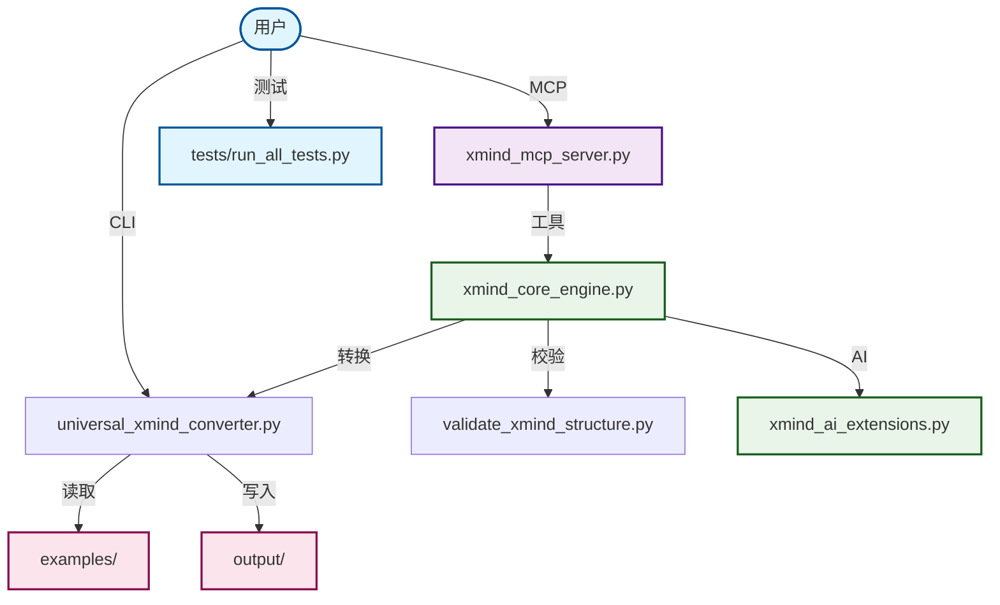

# 🧠 XMind AI MCP – 智能思维导图工具包

将多种格式转换为 XMind，提供 AI 分析与基于 UVX 的 MCP 服务器。

## 更新记录
- 1.3.1：修复 `analyze_mind_map` 与新版读取结构的兼容问题（移除 `data.structure`）。

[](https://opensource.org/licenses/MIT)
[](https://lobehub.com/mcp/master-frank-xmindmcp)

## 🚀 核心功能

### 1. 通用文件转换
- 多格式转换：Markdown、文本、HTML、Word、Excel → XMind
- 智能检测：自动识别文件类型与结构
- 批量处理：一次转换多个文件
- 灵活输出：自定义输出与命名

### 2. MCP 服务器（UVX）
- 仅支持 UVX 部署：不使用 `python` 或 `pip` 直启
- IDE 集成：与 Trae MCP 工具无缝协作
- 支持 FastMCP 与 STDIO 两种模式

### 3. AI 分析
- 结构分析：优化思维导图结构
- 主题建议：AI 生成内容推荐
- 质量指标：全面评估与校验

## 📁 项目结构

```
XmindMcp/
├── configs/                      # MCP 配置
├── docs/                         # 文档与指南
├── examples/                     # 示例输入
├── output/                       # 生成的 XMind 文件
├── tests/                        # 测试套件
├── universal_xmind_converter.py  # 独立转换 CLI
├── xmind_core_engine.py          # 核心引擎
├── xmind_mcp_server.py           # MCP 服务器（FastMCP / STDIO）
├── xmind_mcp/                    # 包入口（`xmind-mcp`）
│   ├── __init__.py
│   └── __main__.py
└── configs/mcp_config.json       # MCP 服务配置（通过 env 设置）
```

## 🔄 架构概览



## 🔧 UVX 快速开始

### 安装 UV（如果尚未安装）
```bash
powershell -c "irm https://astral.sh/uv/install.ps1 | iex"
```

### 运行（已发布包）
```bash
uvx xmind-mcp --mode fastmcp
uvx xmind-mcp --version
uvx xmind-mcp --help
```

### 本地开发（在仓库根目录）
```bash
uvx --from . xmind-mcp --mode fastmcp
# 兼容回退（STDIO）
uvx xmind-mcp --stdio
```

## 🖥️ Trae MCP 集成（UVX）

### 标准配置（推荐）
```json
{
  "mcpServers": {
    "xmind-mcp": {
      "command": "uvx",
      "args": ["xmind-mcp"],
      "env": {
        "PYTHONIOENCODING": "utf-8",
        "PYTHONUTF8": "1"
      },
      "description": "XMind MCP - UVX 安装版",
      "disabled": false,
      "autoApprove": []
    }
  }
}
```

### 本地开发配置（禁止绝对路径）
```json
{
  "mcpServers": {
    "xmind-mcp": {
      "command": "uvx",
      "args": ["--from", ".", "xmind-mcp"],
      "env": {
        "PYTHONIOENCODING": "utf-8",
        "PYTHONUTF8": "1"
      },
      "description": "XMind MCP - 本地开发",
      "disabled": false,
      "autoApprove": []
    }
  }
}
```

## 📦 独立转换（CLI）

### 单文件
```bash
python universal_xmind_converter.py examples/test_markdown.md
python universal_xmind_converter.py examples/test_document.docx --output output/my_mind_map.xmind
```

### 批量转换
```bash
python universal_xmind_converter.py examples/ --batch
python universal_xmind_converter.py examples/ --batch --format markdown,html,txt
```

## 🛠️ 可用 MCP 工具
- `read_xmind_file(file_path)` – 读取 XMind 内容
- `create_mind_map(title, topics_json, output_path?)` – 创建导图
- `analyze_mind_map(file_path)` – 分析结构与指标
- `convert_to_xmind(source_filepath, output_filepath?)` – 多格式转 XMind
- `list_xmind_files(directory?, recursive?)` – 列出 XMind 文件
- `translate_xmind_titles(source_filepath, output_filepath?, target_lang?, overwrite?)`

## ✅ 使用示例（Trae MCP）

### 转换 Markdown 文件
```python
convert_to_xmind({
  "source_filepath": "examples/test_markdown.md"
  # 不指定 output_filepath 时，使用服务器配置的默认绝对输出目录（若已配置）
})
```

### 创建导图（通过配置默认目录）
```python
create_mind_map({
  "title": "项目计划",
  "topics_json": [{"title": "里程碑1"}, {"title": "里程碑2"}]
  # 若已配置默认绝对输出目录，则无需传入 output_path
})
```

### 分析现有导图
```python
analyze_mind_map({
  "file_path": "output/test_markdown.xmind"
})
```

## ⚙️ 路径与配置
- 文档示例使用相对路径以提高可读性。
- MCP 输出型工具需使用绝对输出目录：通过 IDE 的 `configs/mcp_config.json` 中 `env` 或 CLI `--default-output-dir` 配置为绝对路径。
- 如果未配置默认输出目录，调用工具时必须传入绝对的 `output_path`/`output_filepath`；相对路径会被拒绝。

## 🧪 运行测试
```bash
python tests/run_all_tests.py
python tests/run_all_tests.py --english
python tests/test_setup.py
python tests/test_core.py
```

## 📖 文档
- `docs/TRAE_MCP_SETUP.md` – IDE MCP 配置
- `docs/UNIVERSAL_CONVERTER_USAGE.md` – 独立转换用法
- `docs/xmind_ai_mcp_design.md` – 架构与设计

## 🎨 支持的格式
- Markdown（`.md`, `.markdown`）
- 文本（`.txt`, `.text`）
- HTML（`.html`, `.htm`）
- Word（`.docx`）
- Excel（`.xlsx`）
- CSV（`.csv`）
- JSON（`.json`）
- XML（`.xml`）
- YAML（`.yaml`, `.yml`）

## 🤝 贡献
- Fork 仓库
- 创建分支（`git checkout -b feature/your-feature`）
- 提交（`git commit -m "feat: add your feature"`）
- 推送（`git push origin feature/your-feature`）
- 发起 Pull Request

## 🔍 质量保证
- 覆盖 9 种文件格式的转换验证
- 保持结构完整性
- 保留内容一致性
- 符合 XMind 格式规范

## 📝 许可证
MIT 许可证 – 详见 `LICENSE`

## 🙏 致谢

- XMind 团队提供的优秀思维导图工具
- Trae IDE 提供的强大开发环境
- 所有帮助改进本项目的贡献者